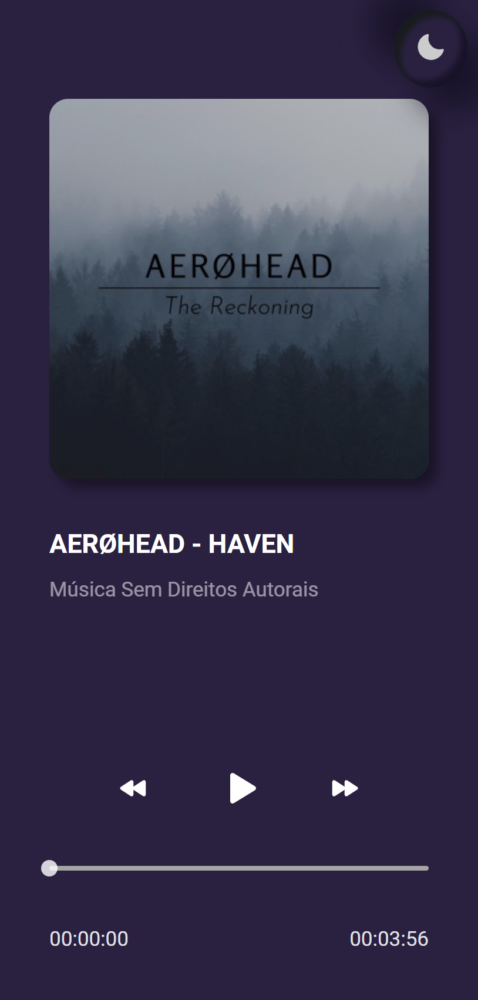
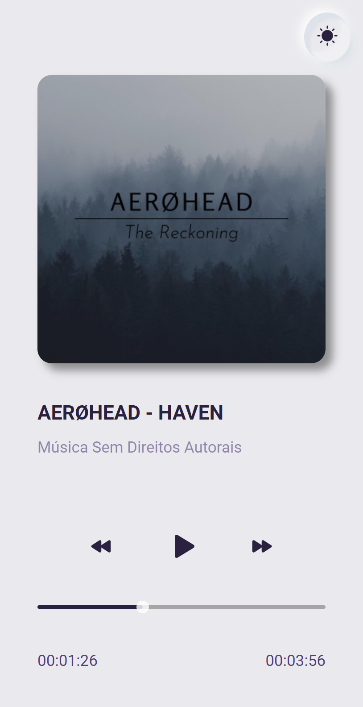

# Music Player Challenge

Este e um projeto criado para o primeiro desafio do #boracodar da rocketseat onde toda quarta será lançado um novo projeto para ser feito por completo.

Neste projeto optei por utilizar o react com vite e typescript.

E utilizando como base o prototipo disponibilizado acabei adicionando umas coisinhas a mais como dark-mode.

Quer ver como ficou? e só clicar [aqui](https://63b9ea2aec314a747198657c--funny-semolina-f7d962.netlify.app/).

Design do figma [aqui](https://www.figma.com/file/3tbPIUZ0eaar5EEXY8p8xt/%23boraCodar---Desafio-1-(Copy)?node-id=0%3A1&t=KWEjsinDlWxvaaGJ-0).


```bash
//Para clonar o projeto basta executar o comando abaixo

https://github.com/imatheus-lucas/music-player-challenge.git

//Para instalar as dependencias

yarn install 

//Para rodar o projeto

yarn dev
```

## Tecnologias

- React
- Vite
- Typescript
- Styled-components
- Phosphor-icons

## Imagens





